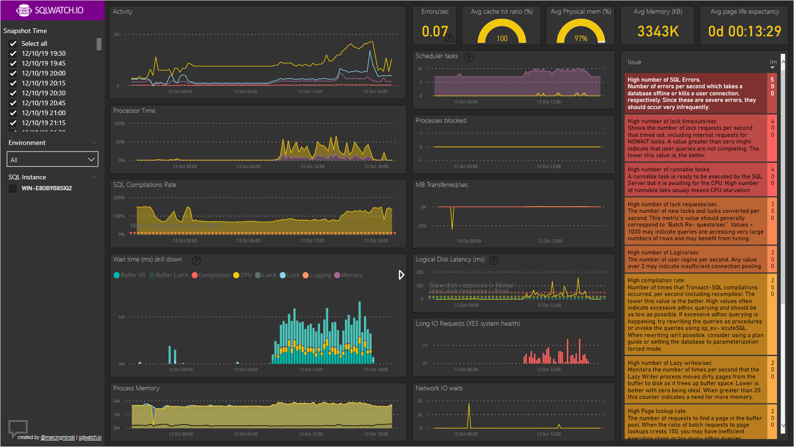

# Configuration

Central Repository can download data from remote instances in two ways:

1. SSIS
2. Linked Server

Both methods do a FULL load of relatively small meta tables and delta loads of the logger tables that contain the actual performance data. Whilst SSIS is a performance optimised engine and may perform faster, there is no noticable performance advantage of using either method and both perform in a similar way when pulling remote data. The advantage of using Linked Server is that it does not require SSIS and can be run on a SQL Server Express Edition with jobs invoked via Windows Scheduled Tasks instead of the SQL Agent.  

## Add Remote Instance

In order for the central respository to know which remote instances to collect data from, they must be defined in `[dbo].[sqlwatch_config_sql_instance]`

 This can be achieved by directly inserting data into the table, or by executing a stored procedure:

```sql
exec [dbo].[usp_sqlwatch_user_repository_add_remote_instance]
    @sql_instance --sql instance name,
    @hostname --hostname, if different to the @sql_instance, for example this could be in IP if no DNS records present,
    @sql_port --non standard sql port, leave NULL for the default 1433,
    @sqlwatch_database_name --name of the SQLWATCH database,
    @environment --name of the environment (DEV,PROD,QA or anything) - this is for the user convinience,
    @linked_server_name --name of the linked server, a new LS will be created if not exists. If you prefer to use existing LS, leave this blank and manually update [linked_server_name] in [dbo].[sqlwatch_config_sql_instance]. If you are using SSIS, leave NULL. 
    @rmtuser --username for the linked server authentication, leave NULL for default Windows Auth or when using SSIS,
    @rmtpassword --password for the linked server authentication, leave NULL for default Windows Auth or when using SSIS,
```

![\[dbo\].\[sqlwatch\_config\_sql\_instance\]](../../.gitbook/assets/image%20%2858%29.png)

## Linked Server

In order to invoke collection via Linked Server, linked server to SQLWATCH database on each monitored instance must be created. This can be achieved by executing stored procedure `dbo.usp_sqlwatch_user_repository_create_linked_server`

###  Create all required linked servers

The procedure can create all required linked servers as per the  `[linked_server_name]` column in `[dbo].[sqlwatch_config_sql_instance]` table:

```sql
exec [dbo].[usp_sqlwatch_user_repository_create_linked_server]
    @rmtuser --optional user name for the remote instance (same for all) or blank to use default windows auth,
    @rmtpassword --optional password for the remote instance (same for all) or blank to use default windows auth
```

### Create specific linked server

Alternatively, it can create only specific linked server. This is the default bahavior when executing `[dbo].[usp_sqlwatch_user_repository_add_remote_instance]`

```sql
exec [dbo].[usp_sqlwatch_user_repository_create_linked_server]
    @sql_instance --name of the existing sql instance in [dbo].[sqlwatch_config_sql_instance],
    @linked_server --optional, name of the required linked server. if blank a default name will be created,
    @rmtuser --optional user name for the remote instance (same for all) or blank to use default windows auth,
    @rmtpassword --optional password for the remote instance (same for all) or blank to use default windows auth
```

### Create remote collector jobs

Linked Server collector can be multithreaded and there is no limit on the number of threads providing the performance of the central repository is adequate. The linked server approach creates a table based queue of all remote objects to import with the required dependency \(i.e. meta tables first, the logger tables\) in `[dbo].[sqlwatch_meta_repository_import_queue]`

The queue can be then processed by executing stored procedure:`exec [dbo].[usp_sqlwatch_repository_remote_table_import]`

To increase the number of import threads schedule the above procedure multiple times.

To create default repository agent jobs, please execute the below procedure:

```sql
exec [dbo].[usp_sqlwatch_config_set_repository_agent_jobs]
    @threads = --number of thread jobs to create
```

This will result in the following jobs to be created:

1. A single enqueuing job that will create list of remote objects to pull data from and control how often they are pulled. 
2. A single or multiple import jobs, depending on the `@threads` variable that will process the import queue. These jobs can run every 1 minute.


## SSIS

### Package Configuration

To configure SSIS package, navigate to the Project in the **Integration Services Catalogs**:



You can apply configuration to the project, or individual packages. The project will contain the collection of all configuration options from child packages.




### Control package

The control package `control_import.dtsx` is responsible for orchestrating multi-threaded data collection and execution of the Worker Package `import_remote_data.dtsx`


#### Parameters

**number\_of\_parallel\_collectors**  
Number of threads for parallel collection. If this is set to &gt; 1, then multiple servers will be collected in parallel, in addition to each collector data flow being run in parallel, according to the `MaxConcurrentExecutables` parameter. Be careful as running parallel collectors may be slower than single thread. Make sure central repository can sustain the workload. Maximum allowed parallel threads are 8.

**repository\_database**  
Name of the database where the central repository is. Default SQLWATCH.

**repository\_instance\_name**  
Name of the SQL Server instance where the central repository is hosted.

**repository\_password**  
SQL Password to access central repository or blank for Windows authentication.

**repository\_user\_name**  
SQL User to access central repository or blank for Windows authentication.

### Worker Package

The worker package `import_remote_data.dtsx` is responsible for the actual data collection from remote instances into the central repository. 


#### Parameters

**last\_snapshot\_offset\_minutes**  
Offset in minutes to increase delta time slice. By default only data since last snapshot will be collected from the remote instance. We may increase this and go further beyond that to cover any gaps. Behind the scenes this translates to `[snapshot_time] > dateadd(minute,-@last_snapshot_offset_minutes,[last_snapshot_time])`


Not currently used, reserved for future use


**remote\_instance\_name**  
SQL Instance to collect data from. This parameters is passed from the control package during run time.

**remote\_password**  
SQL Password for the remote instance or blank for Windows authentication.

**remote\_user\_name**  
SQL User for the remote instance or blank for Windows authentication.


In the current implementation it is not possible to specify different accounts for accessing remote instances. This means that when using SQL Authentication all instances must have the same SQL User and Password. When using Windows authentication this is usually not a problem as the SSIS runs under a context of one the SQL agent or proxy account


**repository\_database**  
Name of the database where the central repository is. Default SQLWATCH.

**repository\_instance\_name**  
Name of the SQL Server instance where the central repository is hosted.

**repository\_password**  
SQL Password to access central repository or blank for Windows authentication.

**repository\_user\_name**  
SQL User to access central repository or blank for Windows authentication.

### Execution

### Central repository collector

The package does delta loads of the `logger*` tables and full loads of the `meta*` tables. Meta tables are relatively small and should not contain more than a few hundred rows. Logger tables can be quite big and thanks to delta loads, the more often the package runs, the less data it pulls with every run.

There is no predefined agent job for the repository collector due to variety of environments, Once the package has been deployed onto the preferred Integration Services Server and configured please crate agent job with the schedule as you please. 

When scheduling the `dtsx`, the control package should be called from the agent job:



