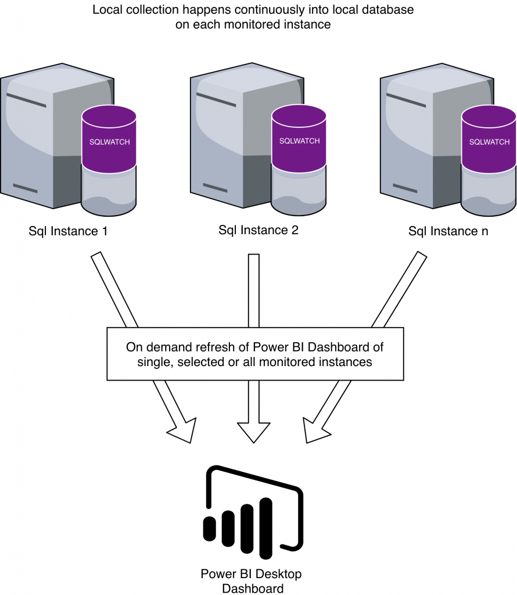

# Architecture

SQLWATCH is a distrubuted monitoring system with centralised reporting, but without centralised repository. It relies on the SQL Server Agent to invoke data collection and thefore the collectiom must happen to a local database.

