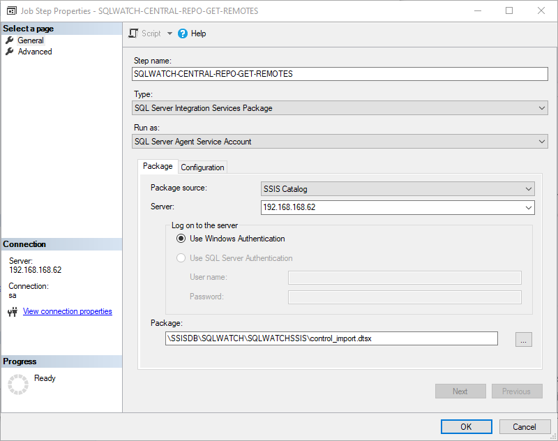

# Post-deployment configuration

Default configuration is applied during deployment and although there is no manual post-deployment configuration required the collection will not start until the job `SQLWATCH-INTERNAL-META-CONFIG` runs. The job is scheduled to run every 1 hour but can be run manually post-deployment to speed up data collection.

This job is responsible for collection dimension objects, i.e. list of databases, tables, indexes etc for the normalised schema. Equally, when new database or table is added, any metric that relates to this database or table will not be collected until the job `SQLWATCH-INTERNAL-META-CONFIG` runs again. This is to improve performance of the performance collector job and avoid getting list of relatively static objects every minute. 

`exec msdb.dbo.sp_start_job @job_name = 'SQLWATCH-INTERNAL-META-CONFIG'`

## Enabling Agent Jobs

### Local collector jobs

All jobs are enabled by default with the exception of the `SQLWATCH-LOGGER-WHOISACTIVE` which is only enabled when `sp_WhoIsActive` is found in the `master` database. If not found, the job is deployed in a disabled state. 

### Central repository collector

There is no predefined agent job for the repository collector due to variety of environments, Once the package has been deployed onto the preferred Integration Services Server and configured please crate agent job with the schedule as you please. 

When scheduling the dtsx, the control package should be called from the agent job:

## Enabling Extended Events Sessions \(XES\)

A number of Extended Events Sessions are also deployed with SQLWATCH in a disabled state. This is because some DBAs will have their own XES sessions and we would not want to interfere without prior notice. However, certain functionality will not be available, for the full experience please enable SQWLATCH sessions.

`ALTER EVENT SESSION SQLWATCH_blockers ON SERVER  
STATE = start;  
  
ALTER EVENT SESSION SQLWATCH_long_queries ON SERVER  
STATE = start;  
  
ALTER EVENT SESSION SQLWATCH_waits ON SERVER  
STATE = start;`

