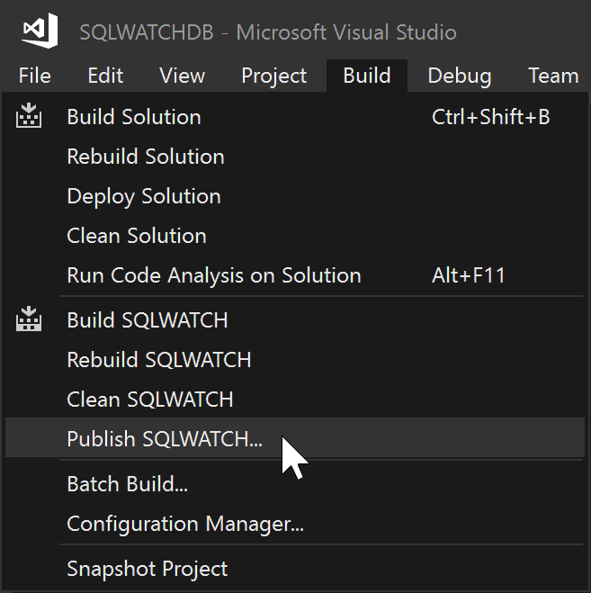
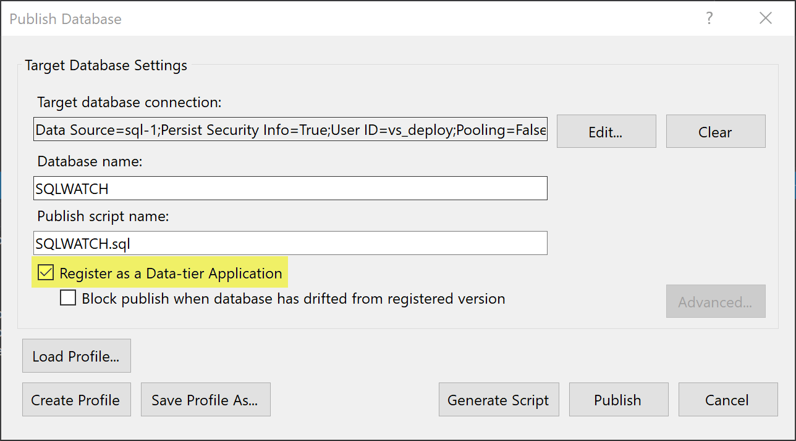
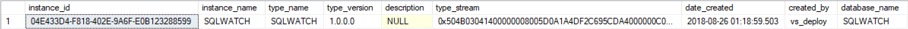
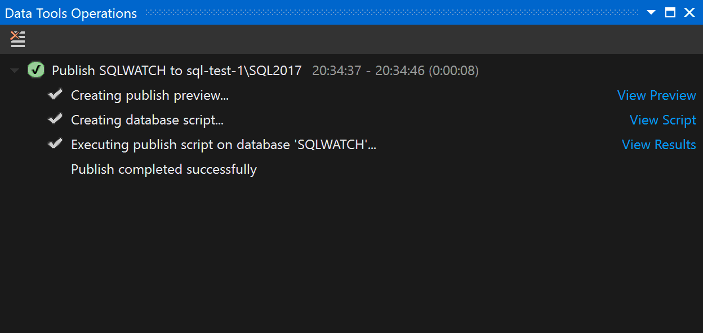

# Deploy from source code

## Introduction

SQLWATCH is developed in Visual Studio Community. You can obtain a free copy of the Community edition on [Microsoft website](https://visualstudio.microsoft.com/vs/express/). You can also use Visual Studio Standard or Professional.

## Prerequisites

1. Visual Studio with SQL Server Data Tools \(SSDT\) installed. 

> You can learn more about SSDT on the [Microsoft website](https://docs.microsoft.com/en-us/sql/ssdt/download-sql-server-data-tools-ssdt)

## Installation

Download source code from GitHub. If you are planning on contributing to the project or making changes you will have to clone \(or fork\) the latest master or development branch. You can also download a source code attached to a release which will contain snapshot of the master branch at the time of build.

To deploy from Visual Studio follow the below steps:

Open solution in Visual Studio and go to Build in the main menu and select Publish SQLWATCH:



Next, set connection to your SQL Server where you would like to deploy it:



> Make sure you tick “Register as a Data-tier Application” in the Publish Database Options. This will make an entry in the `msdb.dbo.sysdac_instances` which will allow you to see which version is installed.

```text
select * from msdb.dbo.sysdac_instances where database_name = 'SQLWATCH'
```



You can track progress in the Output pane:



