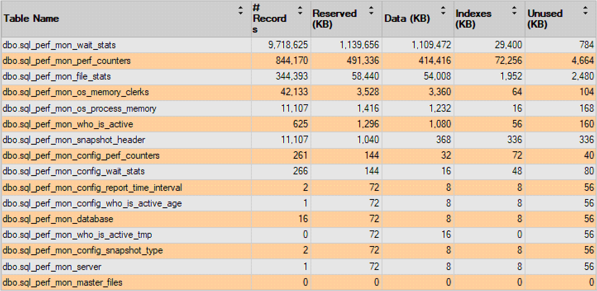

# Requirements

## SQL Server requirements

SQLWATCH has been tested on the following SQL Server versions:

* 2008 R2 SP3
* 2012
* 2014
* 2016
* 2017 \(including docker and linux\*\)

> SQLWATCH works on docker and linux except the disk collector which relies on the Windows' WMI interface.

SQL Server Express and Azure SQL are not supported as there is no Agent to invoke data collection. Theoretically, data collection would be possible via SQLCMD triggered from the Windows Task Scheduler or another Standard Edition instance in case of the Express edition and, for example, Azure Runbook in case of Azure SQL but this has not been tested.

## Workstation requirements

It is expected that the Power BI Desktop dashboard will be run on a client PC. There are no specific requirements for SQLWATCH apart from Power BI Desktop requirements which can be found on the [Power BI website](https://docs.microsoft.com/en-us/power-bi/desktop-get-the-desktop#minimum-requirements).  

## Storage utilisation

The amount of space used by SQLWATCH depends on the retention period and the number of databases on a server. On a server with 10 databases and 7 days retention, the size is around 1.8 GB with majority occupied by `wait_stats` and `performance_counters`

## Permissions

### SQL Server permissions required for deployment

In order to install SQLWATCH the following minimum permissions are required:

| Permission | reason |
| :--- | :--- |
| `dbcreator` | Create SQLWATCH database as part of the deployment process |
| `GRANT CREATE ...` | Object creation during the deployment.  |
| `SQLAgentUserRole` | Create SQL Agent jobs |

### SQL Server permissions required for operation

In order to retrieve data from the SQLWATCH database the following permissions are required:

| Permission | Description |
| :--- | :--- |
| `db_datareader` | Read data from all tables and views |
| `EXECUTE` scalar functions | Scalar functions are required as part of data retrieval. |

