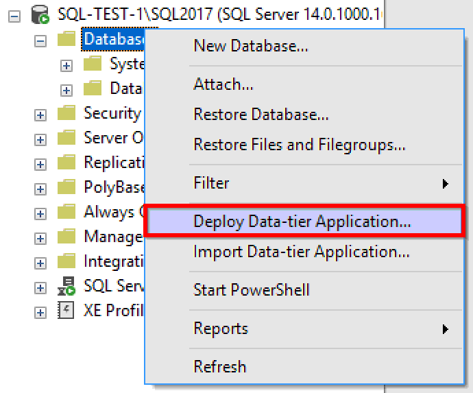
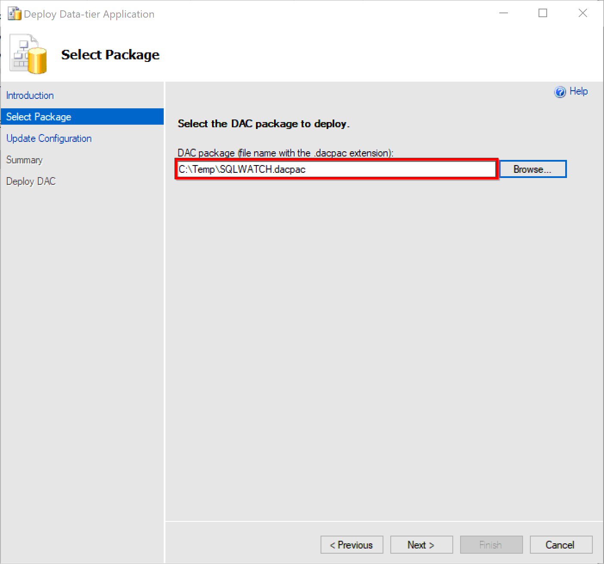
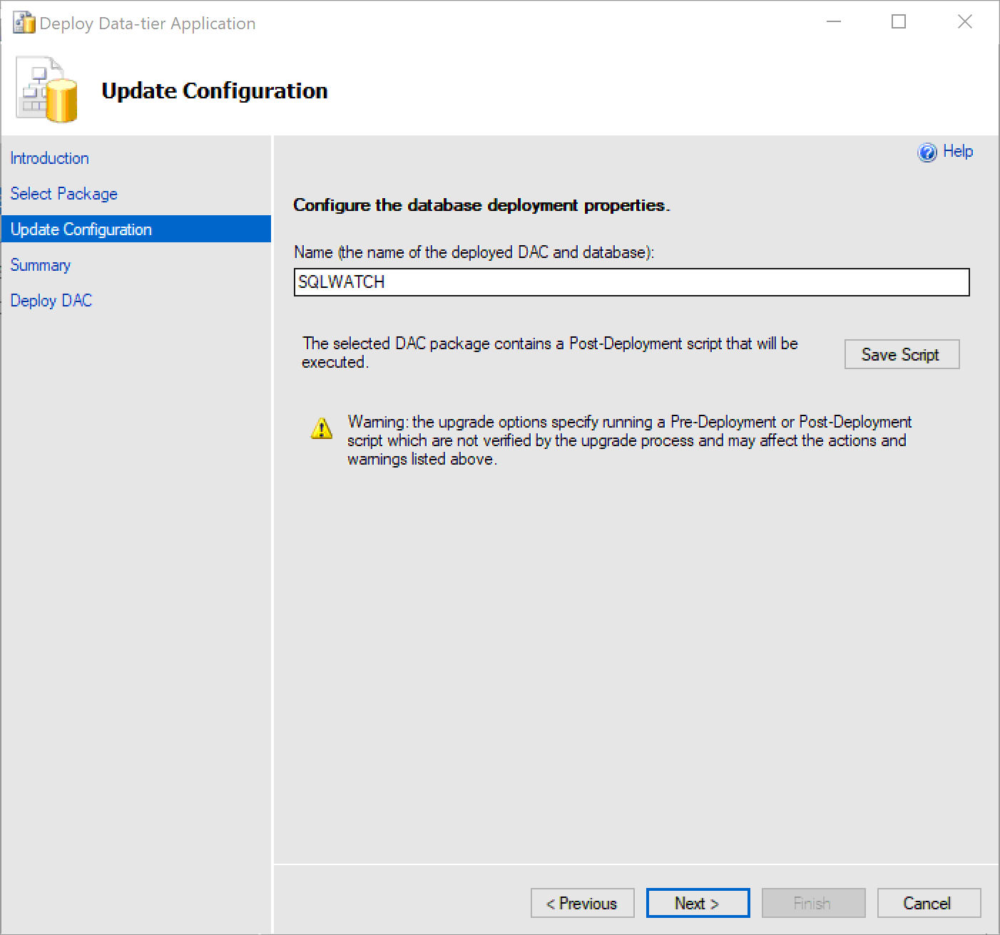
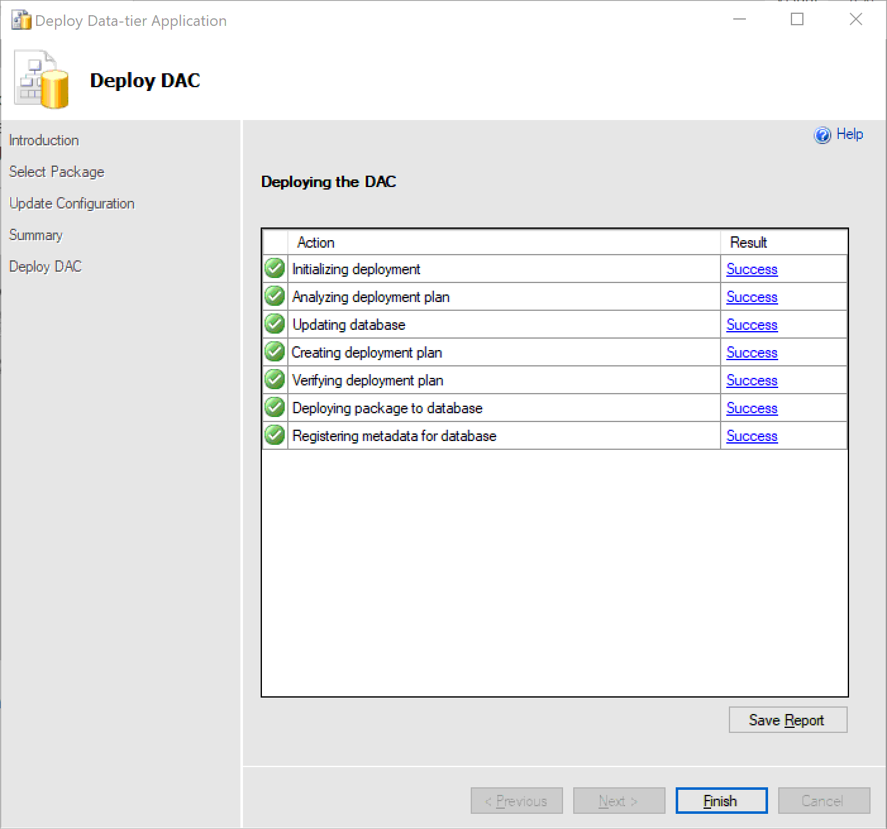

# Install with SSMS

## Introduction

SQL Server Management Studio \(SSMS\) is a free, integrated development environment \(IDE\) for SQL Server.



## Prerequisites

1. SQL Server Management Studio that supports DacPac deployment must be installed prior to installation. This can either be on a client PC or server.

## Installation

Download the required release from our [GitHub Releases](https://github.com/marcingminski/sqlwatch/releases) and unzip. In this example we are using C:\Temp

Connect to the desired SQL Server, right click on Databases and select Deploy Data-Tier Application:

Find the SQLWATCH.dacpac you have downloaded and unzipped

Specify database name, default and recommended is SQLWATCH:

Click next for a summary screen and Next one more time to execute deployment. It can take a minute or two:

