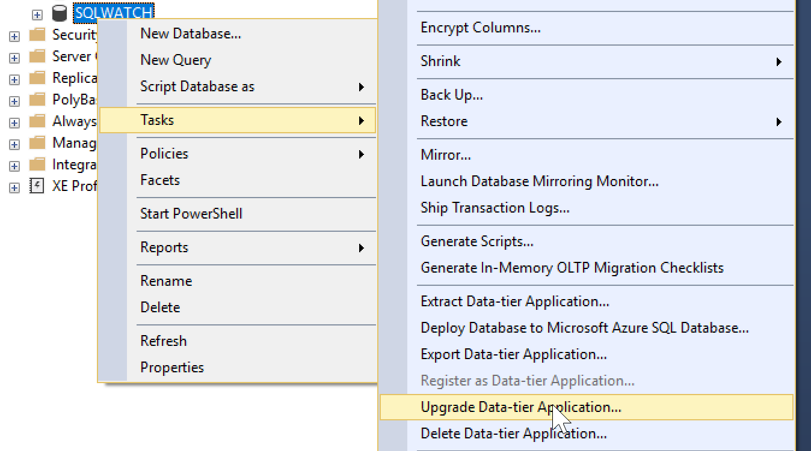

# Upgrade

Similarly to the installation, SQLWATCH can be upgraded in various ways.


Direct upgrade to 2.0 from previous versions is currently not supported. Due to the number of breaking changes I am working on manual data migration scripts, however until these are ready, please deploy as a new database. If you would like to retain old performance data you can rename or backup old SQLWATCH databases.


## Upgrade with dbatools

To upgrade SQLWATCH using dbatools simply re-run the installation with `Install-DbSqlWatch` and it will automatically bring the database schema to the most recent version. If the database is already the most recent version the `Install-DbaSqlWatch` will not make any changes. 

## Upgrade with SqlPackage.exe

To upgrade with the command line utility `SqlPackage.exe` simply re-run the installation and it will automatically bring the database schema to the desired version. 

## Upgrade with SQL Server Management Studio \(SSMS\)

To upgrade using SQL Server Management Studio please follow the installation steps with the only different being that instead of Deploy Data-tier Application you will have to click on the database you want to upgrade \(SQLWATCH\) and select **Upgrade Data-tier Application**

